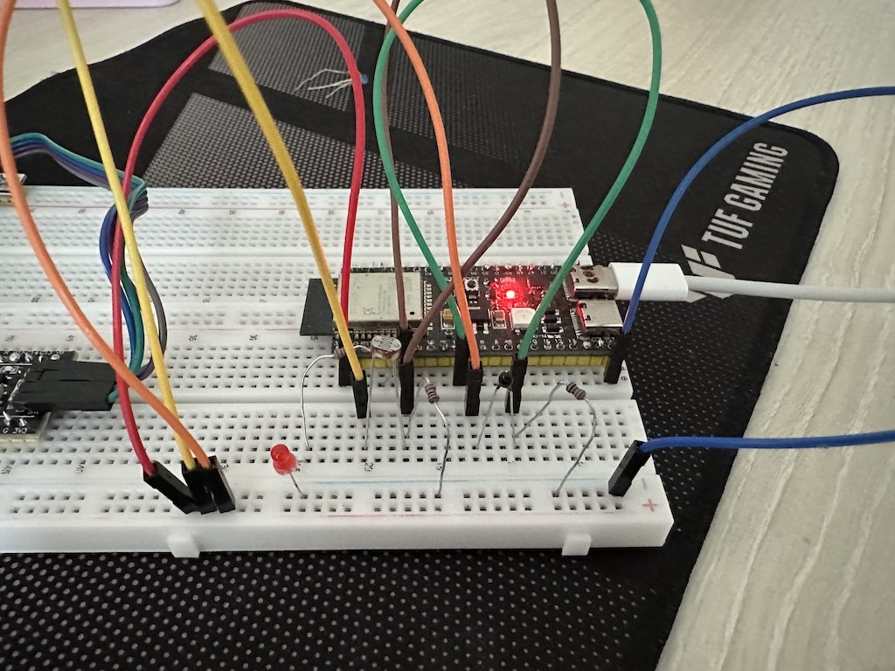

## Модуль 3.2 ADC дані, фоторезистор і термістор (терморезистор)

Структура проекту

```
project/
├── components/
│   ├── config/
│   │   ├── CMakeLists.txt
│   │   └── include/
│   │       └── config.h     <-- Загальний конфіг
│   ├── ldr/
│   │   ├── CMakeLists.txt
│   │   ├── ldr.c            <-- Фунціонал для LDR
│   │   └── include/
│   │       └── ldr.h
│   ├── ntc/
│   │   ├── CMakeLists.txt
│   │   ├── ntc.c           <-- Фунціонал для NTC
│   │   └── include/
│   │       └── ntc.h
└── main/
```

1. Фоторезистор (LDR)
- зчитуємо ADC значення + фільтруємо (SMA)
- використовуємо поріг для вмикання і вимикання світлодіоду. Якщо темно - вмикаємо, якщо світло - вимикаємо.

2. Термістор (NTC)
- зчитуємо ADC значення + фільтруємо (SMA)
- використовуємо формулу для переводу значень в температуру і виводимо в лог.

3. Приклад логів

```
NTC_task: Поточна температура: 21.92 °C (ADC raw: 1906)
LDR_task: It got light (2453) -> Turn off the LED
LDR_task: Raw: 2453 | Filtered: 2452 | LED: 0
NTC_task: Поточна температура: 21.96 °C (ADC raw: 1908)
LDR_task: Raw: 2455 | Filtered: 2452 | LED: 0
NTC_task: Поточна температура: 21.98 °C (ADC raw: 1909)
LDR_task: Raw: 2454 | Filtered: 2454 | LED: 0
NTC_task: Поточна температура: 22.02 °C (ADC raw: 1911)
LDR_task: Raw: 2453 | Filtered: 2452 | LED: 0
NTC_task: Поточна температура: 22.07 °C (ADC raw: 1913)
LDR_task: Raw: 2455 | Filtered: 2452 | LED: 0

```

## Схема підключення на макетній платі


