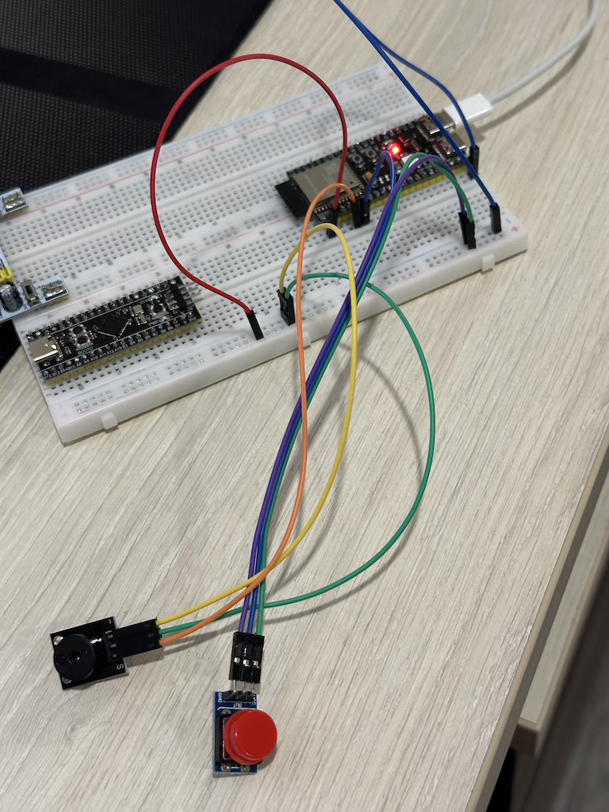

# Модуль 3.4 Програвання звуку на зумері (PWM)

- реалізовано на ESP-IDF
- створюємо массив нот для кожної мелодії ([note.h](./main/note.h)):
   - Jingle Bells
   - Baby Shark
   - Twinkle Twinkle Little Star
   - We Will Rock You
- створюємо "player timer" з періодом 50 мс, який програє кожну ноту з конкретною довжиною
- при запуску ініціюємо всі необхідні дані і запускаємо першу мелодію
- натискання на кнопку, перемикає мелодію на наступну, якщо поточна завершила грати

## Схема на макетній платі

