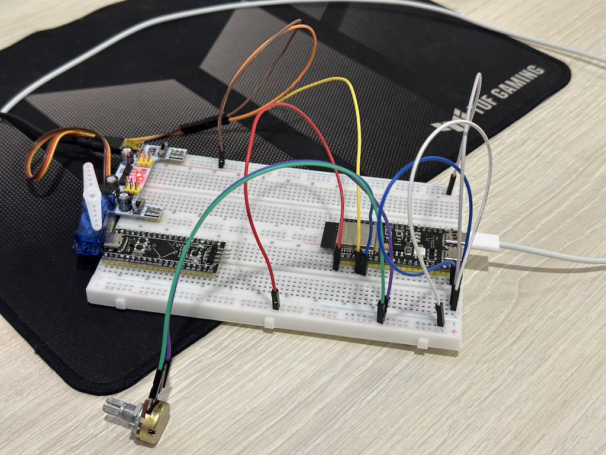

# Модуль 3.5 Керування сервоприводом за допомогою PWM

- реалізовано на ESP-IDF
- Потенціометр керує положенням вала сервоприводу в пропорції 1:1.
- Розбіжність кута повороту сервоприводу та потенціометра обрізається і використовується тільки та частина діапазону, котра збігається.

## Схема на макетній платі

