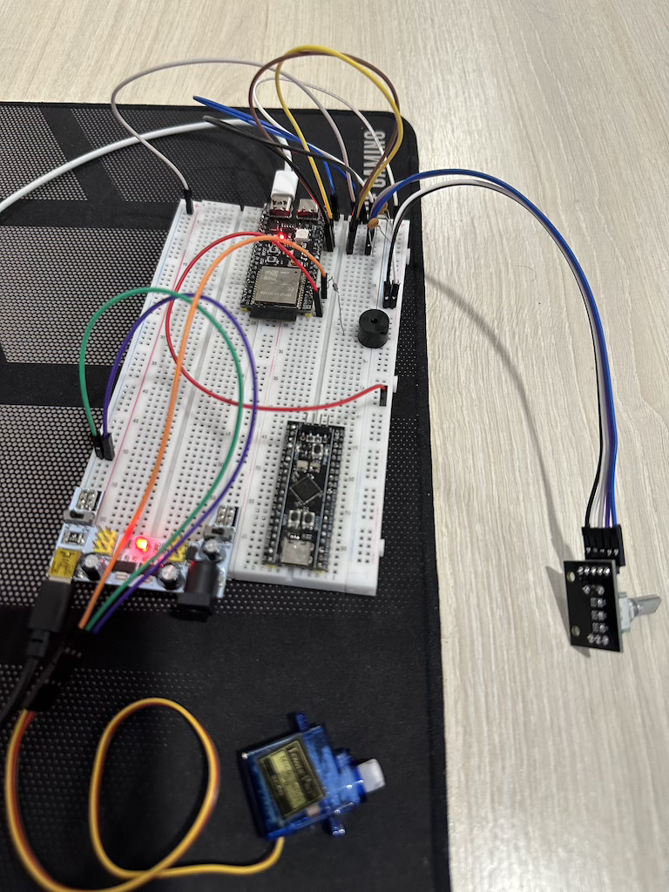

# Модуль 3.6 Як рахувати оберти двигуна або позицію колеса за допомогою Енкодера

## Завдання - Керування сервоприводом
- Керувати сервоприводом за допомогою енкодера
- Один тік енкодера повертає вал сервоприводу на певний кут у відповідному напрямку
- Натискання кнопки енкодера зменшує кут повороту вала сервоприводу удвічі на кожен тік.
- Повторне натискання кнопки повертає точність до більшого кута на кожен тік.
- Коли вал сервоприводу у крайніх положеннях, програвати короткий сигнал у разі спроби прокрутити вал за межі.
- Довге утримання кнопки переводить вал сервоприводу у центральне положення.

## Реалізація і деталі
- реалізовано на ESP-IDF
- реалізовано з розбивкою на компоненти: `servo_control`, `encoder_control`, `buzzer_control`
- додано конденсатори 10nF для зменьшення брязкоті в енкодері
- для сервопривода використовуємо окремий модуль живлення на 5V
- відкалібровано значення сервоприводу для точної зміни від 0 до 180 градусів (350 - 1900 duty)
- додано резистор 220 Ом для зменьшення гучності активного пʼєзодинамика (buzzer)

## Схема на макетній платі

[Video demo](video_demo.mov)