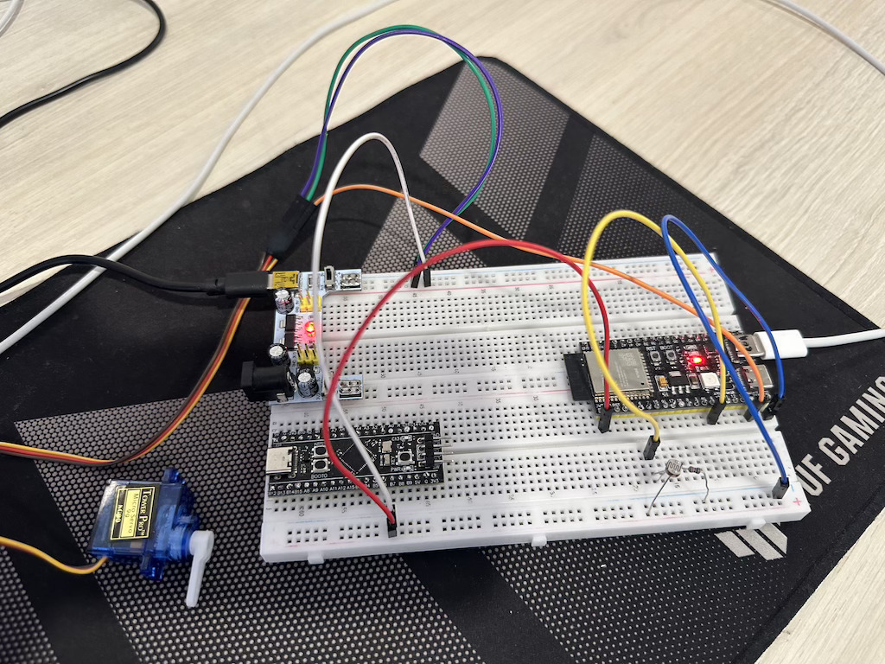

# Модуль 3.7 Мініпроєкт. Завдання: Порефакторити код мініпроєкту

Орігінальний код файлу в `main_legacy.c`

## Реалізація
- зібрав схему
- розбив на окремі файли (компоненти): `ldc`, `servo`
- додав SMA для ldr, щоб значення змінювались плавно
- зробив рефакторінг коду для ldr
- зробив рефакторінг коду для servo
- в `main.c`
    - ініціюємо ldr and servo
    - в `while` циклі зчитуємо значення ldr, конвертуємо в `angle` й передаємо в `angle` в servo
    
## Схема на макетній платі

[Video demo](video_demo.mp4)