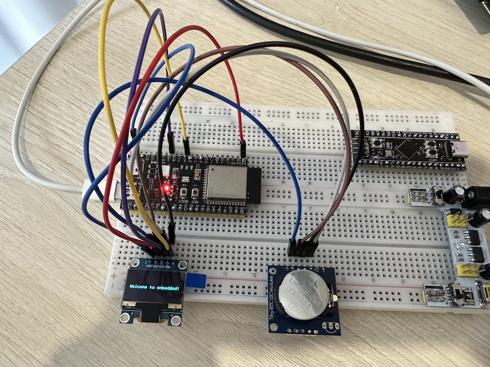

# Модуль 4.2. I²C: Синхронний послідовний інтерфейс із адресацією (TWI)

## Реалізація і деталі (ESP-IDF)
- перевірив функцію `i2c_master_probe` для знаходження адреси підключених мікросхем
- налаштування SSD1306 дісплею і вивід тексту `Welcome to embedded!` на дісплей

## Схема на макетній платі

