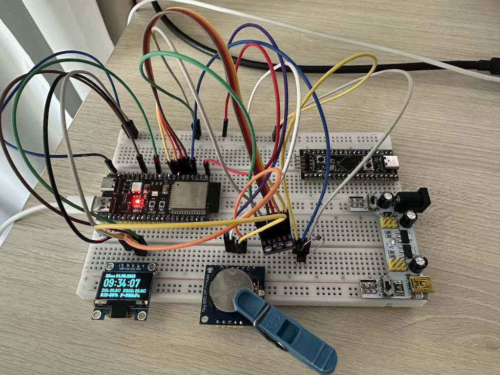

# Модуль 4.4. SPI: Швидка передача даних (Master/Slave)

## SPI BME280

## Реалізація
- реалізовано  на esp-idf v6.x
- весь основний код самої програми в папці `App`
- використовуємо `BME280` (цифровий датчик) через SPI, для отримання температури, атмосферний тиск і вологість повітря. Реалізація в `bme280.h` / `bme280.c`
- використовуємо `DS1307` (RTC clock chip), для встановлення й зчитування дати/часу (через I2C). Реалізація в `rtc_time.h`/`rtc_time.c`
- використовуємо `DS18B20` (digital temperature sensor), для отриманння поточної температури
    - реалізація в `temp_sensor.h`/`temp_sensor.c`
    - використовуються `ds18b20` і `onewire_bus` компоненти
    - зроблено через `task` щоб працювало асинхронно і не навантажувало головний while-цикл, отримуємо температуру кожні 5 сек.
- використовуємо `u8g2` [бібліотеку](https://github.com/olikraus/u8g2.git) для відрісовки даних в `SSD1306`
- додаткові залежні компоненті прописані в `idf_component.yml`

## Схема на макетній платі

[Video demo](video_demo.mp4)