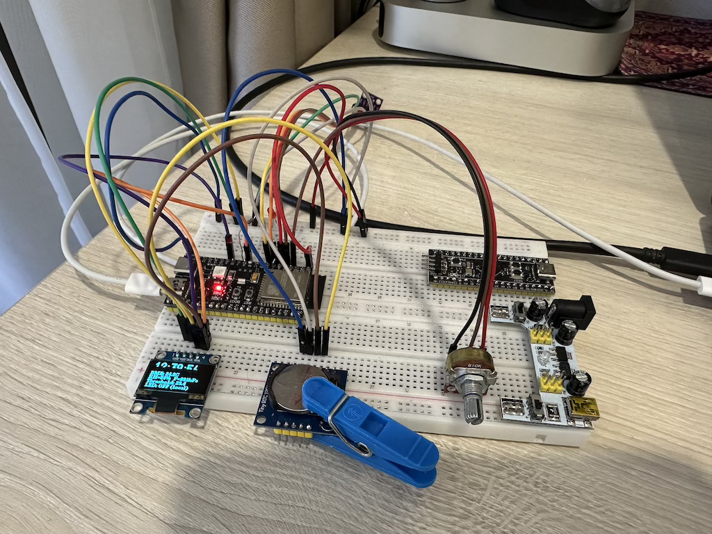
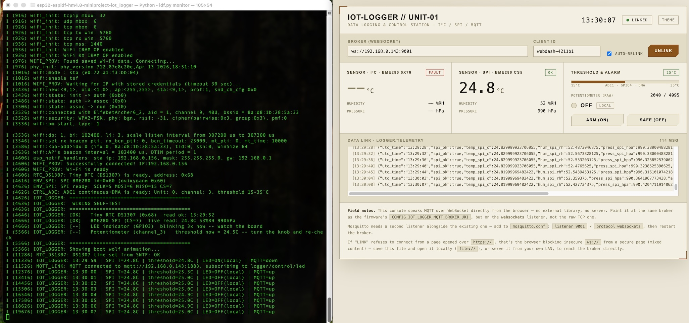

# Мініпроєкт: IoT Logger. Логер даних та керування: I²C/SPI/DMA-телеметрія з дисплеєм і публікацією по MQTT

## Реалізація

- реалізовано на esp-idf v6.1
- компоненти які використовуються: oled display (I2C + u8g2), rtc ds1307 (I2C), wifi, mqtt, led, bme280 (SPI), потенціометр (DMA)
- додаткові компоненти, які необхідні для проєкту: `u8g2`, `network_provisioning`, `mqtt`, `cjson`. Прописані в `main/idf_component.yml`
- додано меню для mqtt і wifi provisioning в `Kconfig.projbuild`

## Як працює

- встановлюємо додаток на телефон - `ESP SoftAP Prov`, це необхідно щоб підʼєднати esp32s3 до WiFi
- інсталюємо MQTT broker в терміналі `sh broker/setup_broker.sh`, якщо вже встановлений і треба просто запустити: `sh broker/setup_broker.sh --no-install`
- заходимо в menuconfig `idf.py menuconfig` -> `IoT Logger Configuration`, вставляємо/копіюємо WiFi IP-адресу яка відображається в запущеному MQTT брокеру
- робимо build `idf.py build` і завантажуємо програму на esp32s3 `idf.py flash` (або `idf.py encrypted-flash`)
- якщо програма запущена вперше або не вдалося підʼєднатись до WiFi, програма запустить SoftAP, треба підключитись до WiFi через `ESP SoftAP Prov` додаток. Додаток попросить ввести pin-code, його можна знайти в `idf.py menuconfig` -> `IoT Logger Configuration` -> `Provisioning Pin`
- коли WiFi налаштований і все ок, на oled display буде відображатись поточний час й інша інформація
- відкриваємо на компʼютері веб-сторінку `web/html/dashboard.html`
- вводимо туди правильну IP адресу (можна знайти її в запущеному MQTT брокеру) і робимо `link`

p.s. На веб-сторінці `Sensor I2C BME280` буде пустим, це ок. В наявності була тільки одна bme280 плата і вона підключена через SPI.

## Схема на макетній платі

[Video demo](video_demo.mp4)
