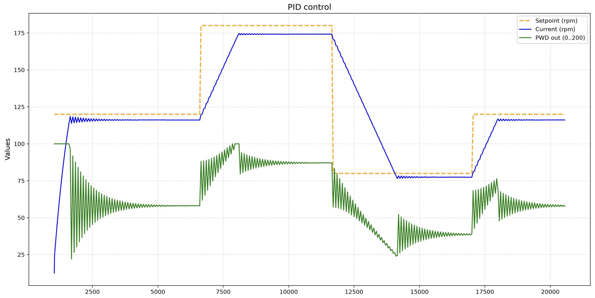
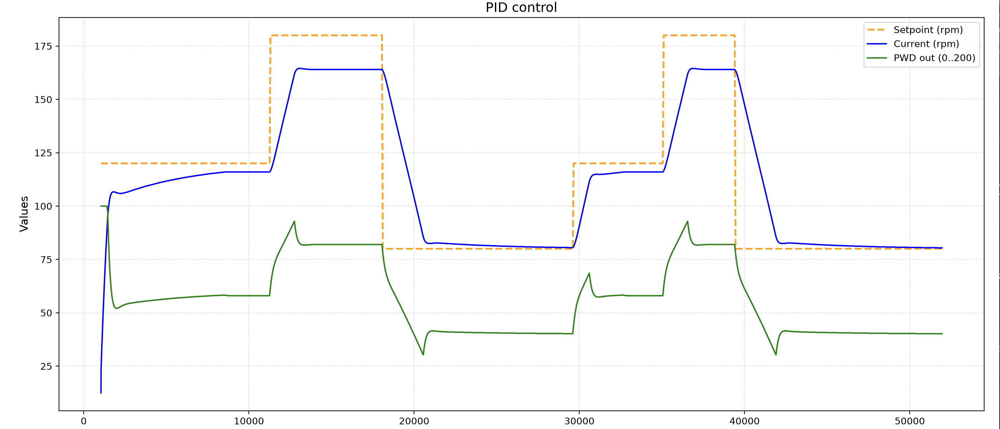
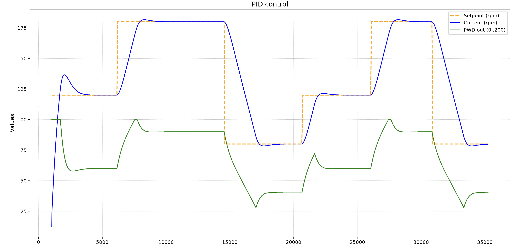
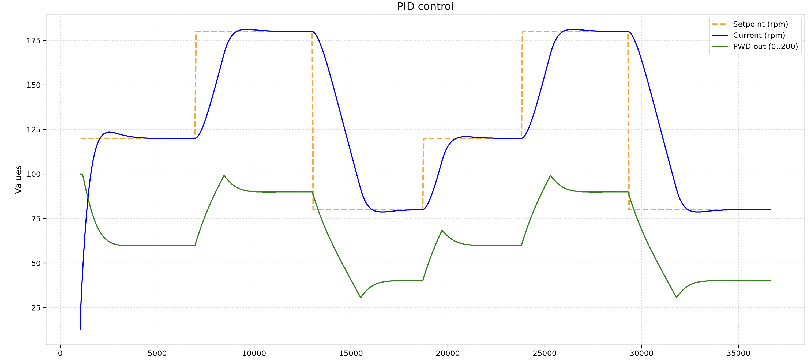
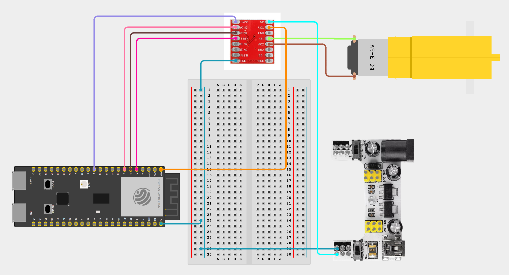
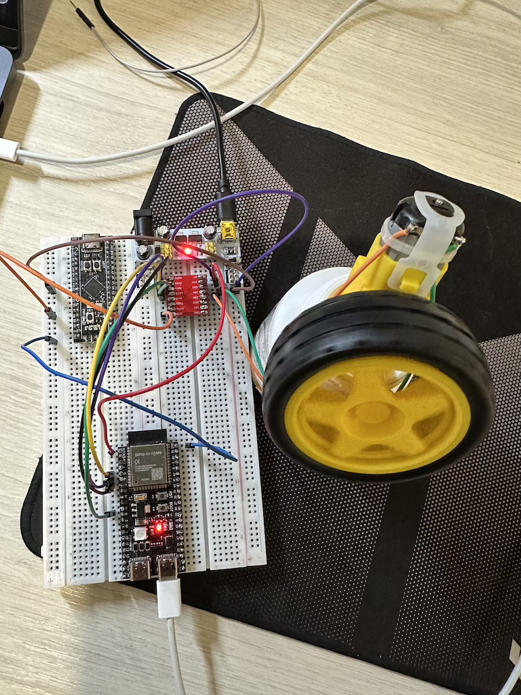

# PID регулятор

Реалізація прикладу використання PID регулятора та налаштування kp, ki, kd.

## Інструменти
- esp32s3
- модуль живлення на 5 вольт
- TT мотор-редуктор з колесом
- драйвер двигуна `TB6612FNG`

## Примітка
Так як для PID-регулятора обовʼязково потрібен зворотний звʼязок, використовується математична модель DC-мотора з урахуванням інерції та тертя. В наявності не було енкодера для зчитування обертів двигуна.

```
motor_plant_t virtual_motor = {
  .speed_rpm = 0.0f,  // поточна змодельована швидкість
  .k_gain = 2.5f,     // коефіцієнт підсилення мотора (RPM на % duty)
  .friction = 1.25f   // коефіцієнт тертя/загасання
};
```

## Графіки з різними налаштуваннями коефіцієнтів

1. kp=15, ki=0, kd=0 (сильні коливання)


2. kp=2.0, ki=0.5, kd=0.1


3. kp=1.2, ki=2.5, kd=0.02


4. kp=0.8, ki=1.5, kd=0.01



## Схема 


## Схема на макетній платі




[Video demo](video_demo.mp4)