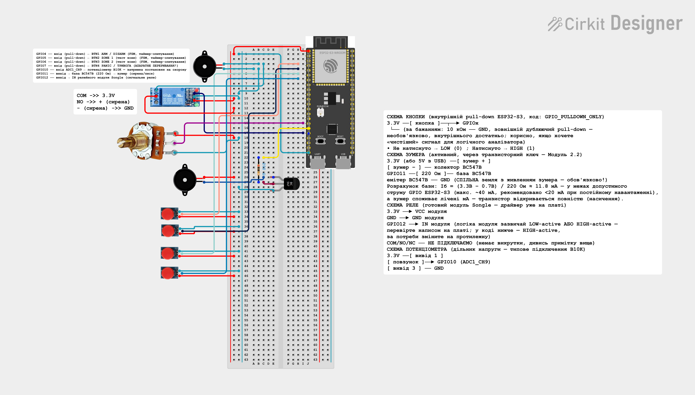

# Охоронна консоль на ESP32-S3

Прошивка охоронної сигналізації (security alarm panel) на базі **ESP32-S3-WROOM** та **ESP-IDF**. Емулює просту охоронну панель: постановка/зняття з охорони з затримкою, дві контрольовані зони, тривожна кнопка (panic), зумер/сирена через реле та потенціометр для налаштування часу затримки постановки.

## Як це працює

Логіка побудована на кінцевому автоматі (FSM) станів системи:

```
DISARMED --(коротке натискання ARM)--> ARMING --(таймаут)--> ARMED --(спрацювала зона)--> ALARM
```

- **DISARMED** — система знята з охорони.
- **ARMING** — йде відлік затримки постановки (3–15 с, залежить від положення потенціометра), зумер пищить дедалі частіше ближче до кінця відліку.
- **ARMED** — система на охороні; спрацювання будь-якої не заблокованої (bypass) зони переводить систему в **ALARM**.
- **ALARM** — увімкнені реле та зумер/сирена; знімається коротким натисканням ARM. Довге натискання ARM у будь-якому стані — це повний скид панелі (bypass та тривоги зон скидаються, реле/зумер вимикаються).

Кнопки зон (ZONE1, ZONE2) симулюють спрацювання датчиків:
- коротке натискання — імітація спрацювання зони (викликає тривогу, якщо система на охороні і зона не в bypass);
- довге натискання — перемикання bypass (виключення зони з контролю).

Окрема лінія **PANIC** (апаратне переривання) має найвищий пріоритет і переводить систему в ALARM з будь-якого стану, незалежно від того, чи вона на охороні.

### Компоненти прошивки

- `components/button_fsm` — антидребезгова обробка кнопок (short/long press) на періодичному `esp_timer` (тік ~10 мс), а також обробка PANIC-переривання.
- `components/load_driver` — драйвер реле та зумера/сирени (підтримує два варіанти підключення зумера: через контакти реле або через транзисторний ключ BC547B з PWM-регулюванням гучності).
- `components/pot_sensor` — читання потенціометра через ADC (12-біт, канал ADC1_CH9), використовується для розрахунку часу затримки постановки на охорону.
- `main/main.c` — головний FSM системи, обробники подій кнопок, задачі зумера (чирп-сигнали через чергу та переривчастий писк під час ARMING).

### Розпіновка (ESP32-S3)

| GPIO | Призначення |
|------|-------------|
| GPIO4  | Кнопка ARM / DISARM |
| GPIO5  | Кнопка ZONE1 (тест зони) |
| GPIO6  | Кнопка ZONE2 (тест зони) |
| GPIO7  | Кнопка PANIC / тривога (апаратне переривання) |
| GPIO10 | Потенціометр (ADC1_CH9) — затримка постановки на охорону |
| GPIO11 | База транзистора BC547B — зумер/сирена (у режимі TRANSISTOR) |
| GPIO12 | IN релейного модуля — сигнальне реле |

## Схема підключення



## Збірка

Проєкт стандартної структури ESP-IDF. Для збірки та прошивки:

```
idf.py set-target esp32s3
idf.py build
idf.py -p <PORT> flash monitor
```

Детальніше про налаштування середовища — у [документації ESP-IDF](https://docs.espressif.com/projects/esp-idf/en/latest/get-started/index.html).
