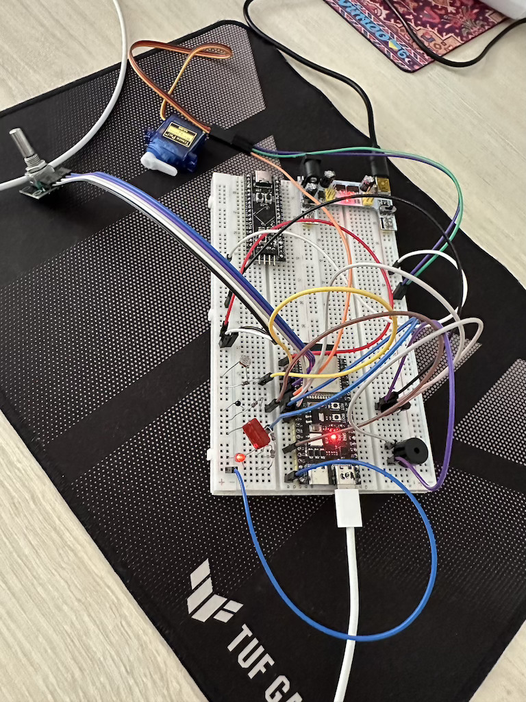

# Тренажер монітора інфузії: лічильник крапель, затискач і аварійний зупин

Інструкція реалізації проєкту: [Drip monitor project guide](drip_monitor_project.md)

## Що зроблено

- реалізував проект згідно інструкції
- зробив code refactoring: додав `config.h` для зручності, перевірка помилок і тп
- зібрав схему і протестував працездатність проекту
- пофіксив баги

## Схема на макетній платі

