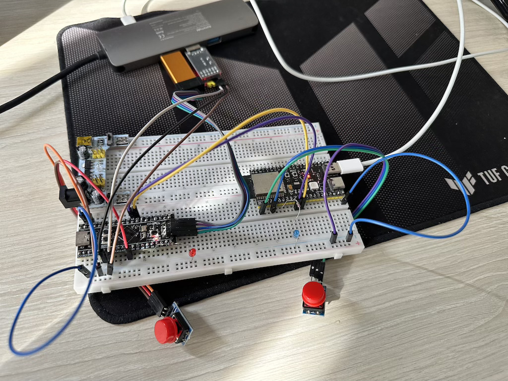

# Модуль 4.1 UART

## Завдання
- При натисненні кнопки на стороні ESP32 змінюється стан світлодіода на стороні STM32
- При натисненні кнопки на стороні STM32 змінюється стан світлодіода на стороні ESP32

## Схема на макетній платі

[Video demo](video_demo.mp4)