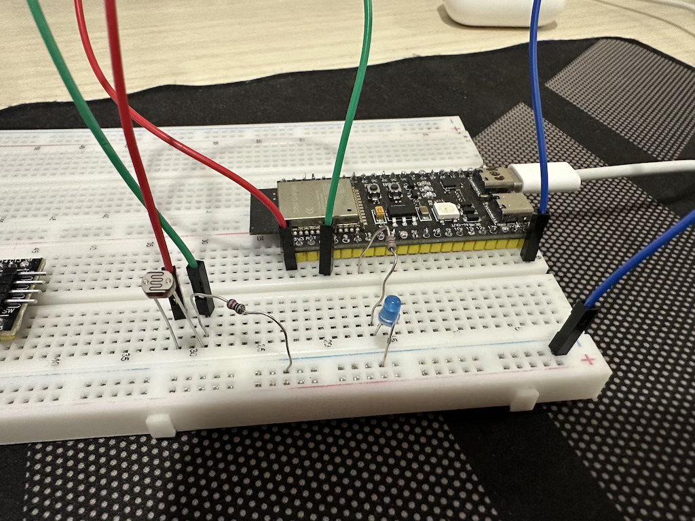

## Модуль 1.6. Плавне керування яскравістю LED (LEDC ШІМ)

- фоторезистор підключено у вигляді подільника напруги
- налаштовуємо ШІМ
- зчитуємо значення АЦП
- змінюємо яскравіcть LED в залежності від АЦП значення

## Схема підключення

