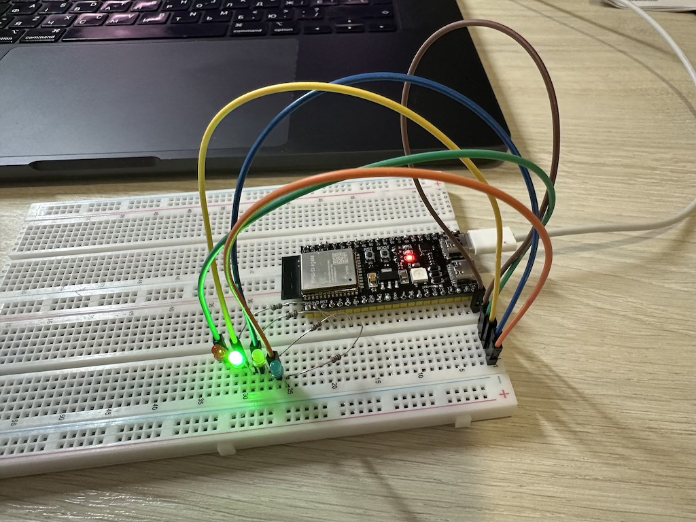

## Модуль 1.4. Світлодіоди і кнопка

- підключено 4 світлодіода, перемикаємо світлодіоди зі швидкістю 500 мілісекунд
- при натисканні на кнопку BOOT -> змінюємо швидкисть перемикання (1000, 500, 200) 
- при довгому натисканні на BOOT -> вимикаємо/вмикаємо всі світлодіоди

## Схема підключення

