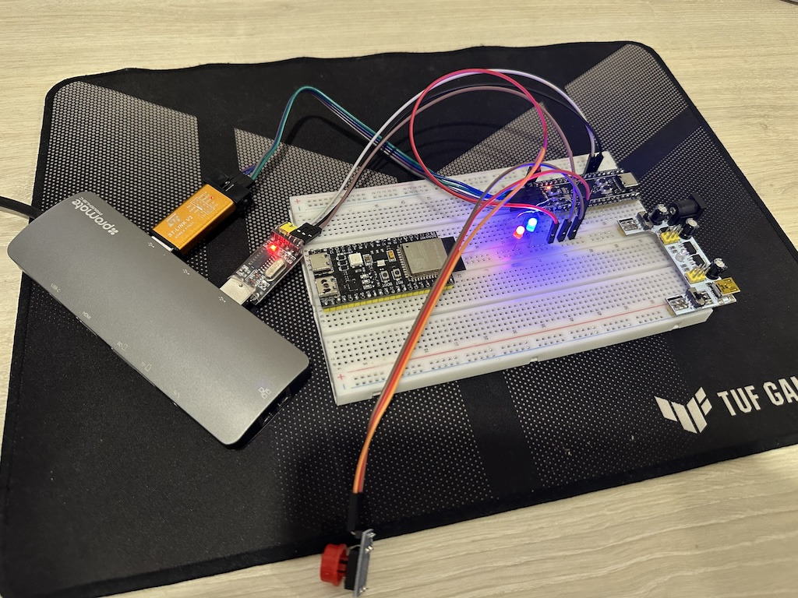
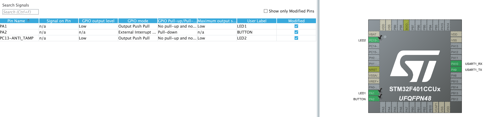

## Модуль 2.8. Знайомство з STM32 (STM32CubeMX + STM32CubeIDE)

1. Створюємо шаблон проєкту за допомогою STM32CubeMX. Додаємо:
	- 2 світлодіода
	- кнопку
	- USART для виводу логів (`printf`)
2. Використовуємо STM32CubeIDE для реалізації задачи:
    - 1 світлодіод блимає раз на секунду
    - Використовуємо кнопку для зміну стану другого світлодіоду
3. Використовуємо перетворювач CH340 для відображення `printf` в терміналі. Попередньо треба встановити драйвер для CH340.
 	- Шукаємо підключений перетворювачь - `ls /dev/cu*`  
 	- Підлючаємо перетворювачь и дивимось логи - `screen /dev/cu.wchusbserial2120 115200`
 	
## Схема на макетній платі

## Конфігурація пінів

