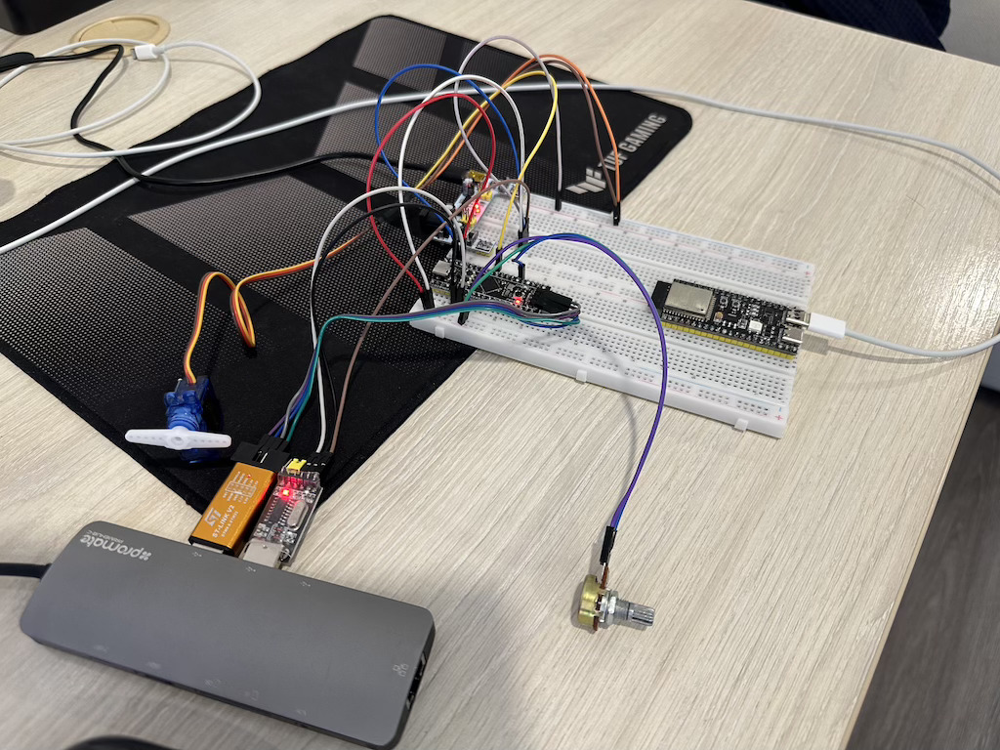

# Модуль 3.5 Керування сервоприводом за допомогою PWM

- реалізовано на STM32CudeIDE/STM32CudeMX
- Потенціометр керує положенням вала сервоприводу в пропорції 1:1.
- Розбіжність кута повороту сервоприводу та потенціометра обрізається і використовується тільки та частина діапазону, котра збігається.

Налаштування таймеру для SG90:
```
Prescaler (PSC) - 15
Counter Period (ARR) - 19999
SYSCLC/HCLK - 16 MHz
```
Налаштування ADC (використовую DMA)
```
Clock Prescaller - divied by 4
Resolution - 12 bits
Continuous Conversion Mode - enabled
DMA continuous requests - enabled
Sampling time - 84 cycles
```
## Схема на макетній платі


