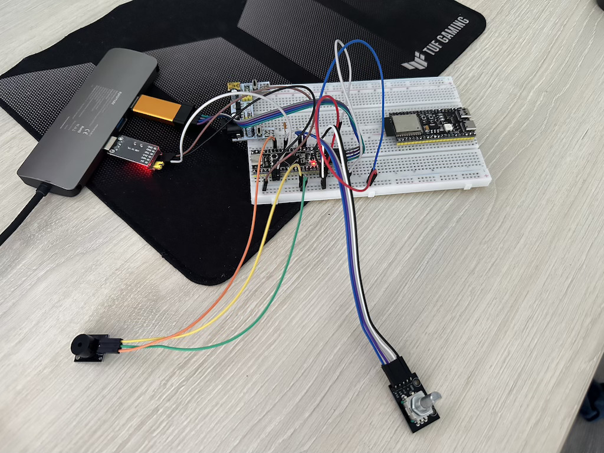

# Модуль 3.6 Як рахувати оберти двигуна або позицію колеса за допомогою Енкодера

## Завдання - Сейф
- Використати енкодер для введення пін-коду для “сейфу”
- Обертання валу в одному напрямку інкрементує одну цифру коду від 0 до 9
- Кількість цифр коду не більше 8. Краще менше.
- Переповнення це спроба або циклічна зміна цифри - на ваш вибір.
- Зміна напрямку обертання валу підтверджує попередню цифру і починає інкрементувати наступну. 
- Перший тік у протилежному напрямку - підтвердження попередньої цифри і значення поточної дорівнює 0.
- Натискання кнопки енкодера - скидання набраного коду і початок нової спроби
- Логувати уведення коду в консолі. Використати `\b` для кращого форматування зміни цифри в консолі.
- Лімітувати кількість спроб до 3, RESET це спроба. Коли спроби вичерпано - програти мелодію сигналізації і/або блокувати мікроконтроллер до перезавантаження
- Успішне введення коду програє мелодію


## Реалізація і деталі
- реалізовано на STM32CubeIDE + STM32CubeMX
- реалізовано через переривання: обертання валу, кнопка, програвання мелодії
- основна логіга реалізована в `app.h`, `app.c` файлах
- програвання мелодії реалізовано в `buzzer_sound.h`, `buzzer_sound.c`
- додано конденсатор 10nF на кнопку енкодера для зменьшення брязкоті

Приклад логування:
```
=== SAFE IS LOCKED ===
Enter PIN-code (4 digits). Attempts left: 3
Code: 2 0 6 3
INCORRECT PIN-CODE!

Attempts left: 2
Code: 0 4 5 3
INCORRECT PIN-CODE!

Attempts left: 1
Code: 0 0 1 1
INCORRECT PIN-CODE!


=======================
 The safe is locked!
=======================
```

```
=== SAFE IS LOCKED ===
Enter PIN-code (4 digits). Attempts left: 3
Code: 2 0 6 3
INCORRECT PIN-CODE!

Attempts left: 2
Code: 0 4 5 3
INCORRECT PIN-CODE!

Attempts left: 1
Code: 0 0 1 1
INCORRECT PIN-CODE!


=======================
 The safe is locked!
=======================
```

```
=== SAFE IS LOCKED ===
Enter PIN-code (4 digits). Attempts left: 3
Code: 3 7 0 5

=======================
 The safe is unlocked!
=======================
```


## Схема на макетній платі




[Video demo](video_demo.mp4)