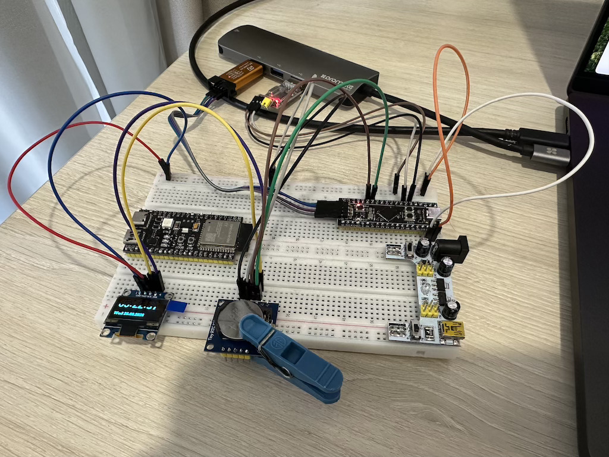

# Модуль 4.3. Зчитування складних даних: робота з регістрами та бібліотеками для I2C-сенсорів

## I²C годинник

## Реалізація
- реалізовано на STM32CubeIDE
- весь основний код самої програми в папці `App`
- використовуємо `DS1307` (RTC clock chip), для встановлення й зчитування дати/часу (через I2C). Реалізація в `ds1307.h`/`ds1307.c`
- використовуємо `u8g2` [бібліотеку](https://github.com/olikraus/u8g2.git) для відрісовки даних в `SSD1306`
- при запуску програми: спочатку відображаємо bitmap-логотип (10 сек), потім годинник.


## Додавання `u8g2`
Щоб программа працювала, треба додати `u8g2` бібліотеку, а саме:
1. Переходимо в папку `Middlewares` і робимо "git clone"
```
git clone https://github.com/olikraus/u8g2.git
```
2. В проєкті компілюємо тільки `u8g2/csrc`
- в `Project Explorer` відкриваємо `properties` для папки `u8g2`, `C/C++ General -> Paths and Symbols` -> ставимо галочку для `Exclude resource from build` -> Apply and close
- Відкриваємо `properties` для папки `u8g2/csrc` і навпаки знімаємо галочку з `Exclude resource from build`
3. Додаємо `u8g2/csrc` в `Include directories`
- Відкриваємо `properties` для проєкту (в `Project Explorer` ПКМ на проєкті)
- `Properties → C/C++ General → Paths and Symbols → Includes` -> додаємо шлях до `Middlewares/u8g2/csrc`

## Схема на макетній платі



[Video demo](video_demo.mp4)