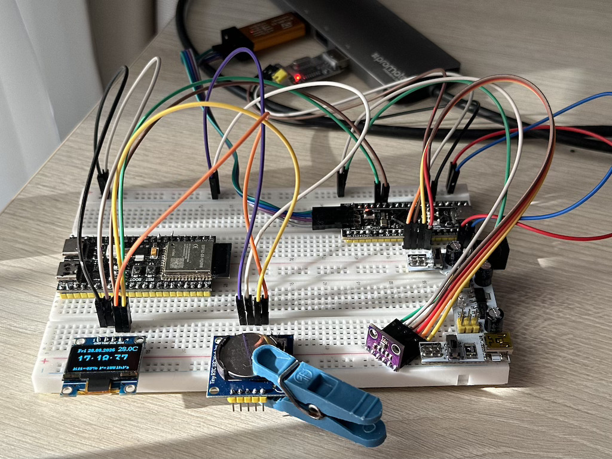

# Модуль 4.4. SPI: Швидка передача даних (Master/Slave)

## SPI BME280

## Реалізація
- реалізовано на STM32CubeIDE
- весь основний код самої програми в папці `App`
- використовуємо `DS1307` (RTC clock chip), для встановлення й зчитування дати/часу (через I2C). Реалізація в `ds1307.h`/`ds1307.c`
- використовуємо `u8g2` [бібліотеку](https://github.com/olikraus/u8g2.git) для відрісовки даних в `SSD1306`
- використовуємо `BME280` (цифровий датчик) через SPI, для отримання температури, атмосферний тиск і вологість повітря. Реалізація в `bme280.h` / `bme280.c`

## Схема на макетній платі

[Video demo](video_demo.mp4)