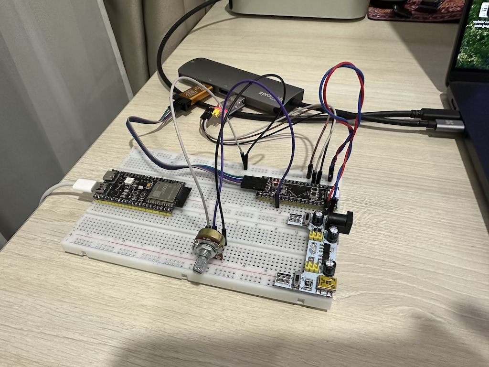

# Модуль 4.6. DMA: Як передавати великі обсяги даних, не навантажуючи процесор

## DMA

## Реалізація
- реалізовано на STM32CubeIDE
- зчитуємо значення з АЦП використовуючи DMA
- зчитані значення виправляємо по UART в консоль використовуючи DMA
- функціонал осцилографа, відображаємо в консолі Vmin, Vmax, Vpp, Vavg

## Схема на макетній платі

[Video demo](video_demo.mp4)