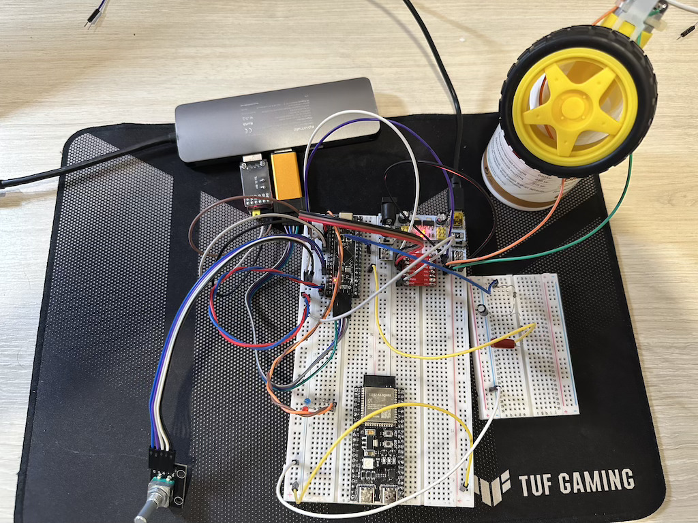

# Модуль 5 Мініпроект. Програмний PID-регулятор на STM32F401 (Black Pill + FreeRTOS)

PID-регулятор тримає задану напругу на виході RC-кола: ШІМ → RC-коло → АЦП → PID → ШІМ.
Уставку задає енкодер, і той самий енкодер показує напрямок мотором і світлодіодами.

## Компоненти
- STM32F401 Black Pill + ST-LINK V2
- Модуль живлення MB102 (перемички на 5V)
- Драйвер мотору `TB6612FNG`
- Жовтий мотор TT 3–6 В
- Енкодер KY-040
- 2 світлодіода (черовний + синий) з резисторами на 220 Ом
- RC-коло:
    - резистор 10 кОм
    - конденсатор 51 мкФ (електроліт)
    - резистор 100 кОм
    - конденсатор 1 мкФ

## RC-коло (об'єкт керування PID)

```
PA6 ──[10 кОм]──●──[100 кОм]──●────► PA1
                │              │
            [51 мкФ]        [1 мкФ]
            + до вузла         │
                │              │
GND ────────────●──────────────●
```

## Реалізація
1. Реалізовано на базі https://gitlab.com/prime72w/pid_regulator, але повністю переписано і відрефакторено на свій лад
2. Замість реле використовується `TB6612FNG` драйвер
3. Додано логування через uart, логер працює через FreeRTOS.

## Схема на макетній платі



[Video demo](video_demo.mp4)