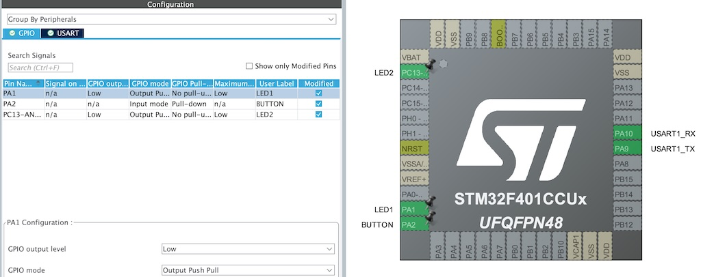

## Модуль 2.9. Знайомство з STM32  (STM32CubeMX + VSCode)

1. Створюємо шаблон проєкту за допомогою STM32CubeMX. Додаємо:
	- 2 світлодіода
	- кнопку
	- USART для виводу логів (`printf`)
2. Використовуємо VSCode для реалізації задачи:
    - Створюємо `app.h` і `app.c` файли і в них `setup()` і `loop`
    - 1 світлодіод блимає раз на 2 секунди
    - Хендлимо кнопку, діод горить коли кнопка в стані pressed
3. Використовуємо перетворювач CH340 для відображення `printf` в терміналі. Попередньо треба встановити драйвер для CH340.
 	- Шукаємо підключений перетворювачь - `ls /dev/cu*`  
 	- Підлючаємо перетворювачь и дивимось логи - `screen /dev/cu.wchusbserial2120 115200`
 	
## Схема на макетній платі

## Конфігурація пінів

